# Финальный проект

## Тема: Построение сети с 0

---

  
Топология

### Топология

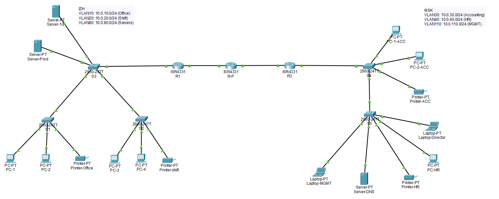

---

  
Используемые технологии

    
- VLAN - выполнена сегментация сети по отделам и назначению (Office/Shift/Servers в Ижевске; Accounting/HR/MGMT в Москве).

- PVST - использован Per-VLAN Spanning Tree для предотвращения L2-петель и обеспечения корректной работы trunk-соединений.

- DHCP - на маршрутизаторах настроены DHCP-пулы для автоматической выдачи IP-адресов в пользовательских VLAN.

- NAT - настроена трансляция адресов для выхода внутренних хостов в сеть провайдера (демонстрация на 8.8.8.8). Межофисный трафик исключён из NAT.

- VPN Site-to-Site IPsec - настроен защищённый туннель между офисами (R1 ↔ R3) для шифрования межофисного трафика.

- ACL - реализована политика безопасности: пользователи HR (VLAN40) не имеют доступа к Accounting (VLAN30); при этом разрешены необходимые сервисы (в т.ч. DHCP и доступ к DNS).

- SSH - настроено безопасное удалённое управление устройствами по SSH v2, вход через локального пользователя.

---

  
Таблицы

  
### Таблица VLAN / подсетей / шлюзов

| Локация | VLAN | Назначение  | Подсеть       | Шлюз (Gateway)        | DHCP             |
|----------|------|-------------|---------------|-----------------------|------------------|
| Ижевск  | 10   | Office      | 10.0.10.0/24  | 10.0.10.1 (R1 subif)  | Да (R1)          |
| Ижевск  | 20   | Shift       | 10.0.20.0/24  | 10.0.20.1 (R1 subif)  | Да (R1)          |
| Ижевск  | 80   | Servers     | 10.0.80.0/24  | 10.0.80.1 (R1 subif)  | Нет (статические)|
| Москва  | 30   | Accounting  | 10.0.30.0/24  | 10.0.30.1 (R3 subif)  | Да (R3)          |
| Москва  | 40   | HR          | 10.0.40.0/24  | 10.0.40.1 (R3 subif)  | Да (R3)          |
| Москва  | 110  | MGMT        | 10.0.110.0/24 | 10.0.110.1 (R3 subif) | Да (R3)          |

### R1 (Ижевск) 

| Назначение                  | Сеть          | Next-hop     |
|------------------------------|----------------|---------------|
| Default route (Интернет)     | 0.0.0.0/0      | 210.210.1.1  |
| Москва VLAN30                | 10.0.30.0/24   | 210.210.1.1  |
| Москва VLAN40                | 10.0.40.0/24   | 210.210.1.1  |
| Москва VLAN110               | 10.0.110.0/24  | 210.210.1.1  |

### R3 (Москва)

| Назначение                  | Сеть          | Next-hop     |
|------------------------------|----------------|---------------|
| Default route (Интернет)     | 0.0.0.0/0      | 210.210.2.1  |
| Ижевск VLAN10                | 10.0.10.0/24   | 210.210.2.1  |
| Ижевск VLAN20                | 10.0.20.0/24   | 210.210.2.1  |
| Ижевск VLAN80                | 10.0.80.0/24   | 210.210.2.1  |
| Ижевск VLAN100               | 10.0.100.0/24  | 210.210.2.1  |

### ISP1 (провайдер)

| Назначение      | Сеть          | Next-hop     |
|-----------------|----------------|---------------|
| Ижевск VLAN10   | 10.0.10.0/24   | 210.210.1.2  |
| Ижевск VLAN20   | 10.0.20.0/24   | 210.210.1.2  |
| Ижевск VLAN80   | 10.0.80.0/24   | 210.210.1.2  |
| Ижевск VLAN100  | 10.0.100.0/24  | 210.210.1.2  |
| Москва VLAN30   | 10.0.30.0/24   | 210.210.2.2  |
| Москва VLAN40   | 10.0.40.0/24   | 210.210.2.2  |
| Москва VLAN110  | 10.0.110.0/24  | 210.210.2.2  |

### DHCP‑пулы — Ижевск (R1)

| DHCP Pool   | VLAN | Сеть        | Маска           | Default Gateway | DNS        | Excluded (не выдаются)     |
|--------------|------|-------------|-----------------|-----------------|------------|----------------------------|
| IZH-VLAN10   | 10   | 10.0.10.0   | 255.255.255.0   | 10.0.10.1       | 10.0.40.2  | 10.0.10.1–10.0.10.30       |
| IZH-VLAN20   | 20   | 10.0.20.0   | 255.255.255.0   | 10.0.20.1       | 10.0.40.2  | 10.0.20.1–10.0.20.30       |
| IZH-VLAN100  | 100  | 10.0.100.0  | 255.255.255.0   | 10.0.100.1      | 10.0.40.2  | 10.0.100.1–10.0.100.30     |

### DHCP‑пулы — Москва (R3)

| DHCP Pool   | VLAN | Сеть         | Маска           | Default Gateway | DNS        | Excluded (не выдаются)     |
|--------------|------|--------------|-----------------|-----------------|------------|----------------------------|
| MSK-VLAN30   | 30   | 10.0.30.0    | 255.255.255.0   | 10.0.30.1       | 10.0.40.2  | 10.0.30.1–10.0.30.30       |
| MSK-VLAN40   | 40   | 10.0.40.0    | 255.255.255.0   | 10.0.40.1       | 10.0.40.2  | 10.0.40.1–10.0.40.30       |
| MSK-VLAN110  | 110  | 10.0.110.0   | 255.255.255.0   | 10.0.110.1      | 10.0.40.2  | 10.0.110.1–10.0.110.30     |

---

  
Текст для защиты

### Пункты

У меня сеть малого предприятия с двумя офисами: Ижевск и Москва. Междуофисами связь сделана через провайдера, а чтобы данные между офисами ходилибезопасно, я настроил VPN IPsec. Внутри каждого офиса сеть разделена наотдельные сегменты, чтобы пользователи разных отделов не мешали друг другу ичтобы было проще управлять.

---

1) VLAN (разделение сети на отделы)
Я разделил сеть на VLAN:

+ В Ижевске: отдельные VLAN для сотрудников (VLAN10 и VLAN20), для серверов (VLAN80) и для управления (VLAN100).
+ В Москве: VLAN для бухгалтерии (VLAN30), для HR (VLAN40) и для управления (VLAN110).

Это сделано, чтобы:
+ разные отделы не были в одной большой “общей сети”,
+ было проще управлять доступом и безопасностью,
+ уменьшить широковещательный трафик.

---

2) Trunk и маршрутизация между VLAN
Чтобы VLAN могли проходить между коммутаторами и до роутера, я настроил trunk-порты.
А чтобы устройства из разных VLAN могли общаться (например ПК из VLAN10 мог достучаться до сервера в VLAN80), я настроил Router-on-a-Stick на роутерах: на одном физическом интерфейсе созданы подинтерфейсы для каждого VLAN и назначены IP-шлюзы (gateway).

---

3) PVST (защита от петель)
Чтобы не было сетевых петель на уровне коммутаторов, включен PVST (Spanning Tree). Он следит за тем, чтобы не возникла ситуация, когда кадры начинают “ходить по кругу” и сеть падает. PVST выбирает главный (root) коммутатор и при необходимости блокирует лишние пути.

---

4) DHCP (автоматическая выдача IP)
Чтобы вручную не прописывать IP на каждом ПК, на роутерах настроен DHCP.
ПК получают:

+ IP адрес,
+ маску,
+ шлюз по умолчанию,
+ DNS.
+ Сервера я оставил на статических адресах, чтобы они всегда были по одному и тому же IP.

---

5) NAT (выход в “Интернет” через провайдера)
Чтобы внутренние адреса 10.0.x.x могли выходить к провайдеру, я настроил NAT overload (PAT).
Это позволяет всем ПК выходить наружу, используя один “белый” адрес WAN интерфейса.
При этом межофисные подсети я исключил из NAT, потому что для VPN важно, чтобы реальные внутренние адреса не подменялись NAT’ом — иначе туннель может не подняться или трафик не будет шифроваться.

---

6) ACL (ограничение доступа)
Я настроил ACL как пример политики безопасности:

+ пользователи из HR (VLAN40) не должны иметь доступ к бухгалтерии (VLAN30),
при этом HR может обращаться к DNS серверу и работать внутри своего VLAN.
То есть ACL показывает, что можно управлять доступом между отделами на уровне маршрутизатора.

7) SSH (безопасное управление)
Для управления оборудованием я включил SSH и запретил небезопасные подключения.
SSH нужен, чтобы логины/пароли не передавались “в открытом виде” как в telnet. Вход происходит через локального пользователя.

8) VPN Site-to-Site IPsec (связь между офисами)
Между R1 (Ижевск) и R3 (Москва) настроен IPsec VPN.
Это значит, что весь трафик между подсетями офисов ходит по защищённому каналу и шифруется.

Как я это доказываю:

+ делаю ping из Ижевска до ресурса в Москве (например до DNS 10.0.40.2),
на роутере смотрю:
+ show crypto isakmp sa — показывает, что этап переговоров (IKE) установлен,
+ show crypto ipsec sa — показывает, что есть ESP SA и растут счётчики (encaps/decaps), значит трафик реально шифруется.

---

  
Реализация

  
### VLAN 

В данном примере показаны VLAN города Ижевск

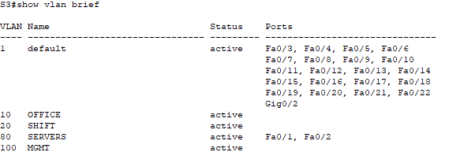

В данном примере показаны VLAN города Москва

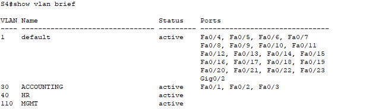

---

### TRUNK

В данном примере показаны trunk-port города Ижевск

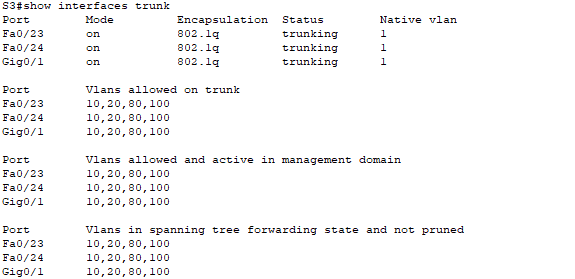

В данном примере показаны trunk-port города Москва

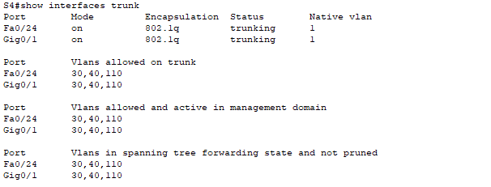

---

### PVST

В данном примере показан Switch 3, который находиться в городе Ижевск

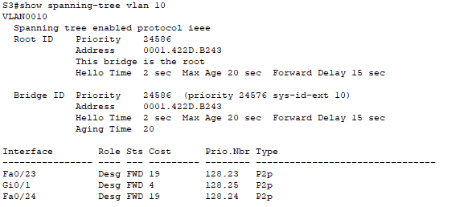

В данном примере показан Switch 4, который находиться в городе Москва

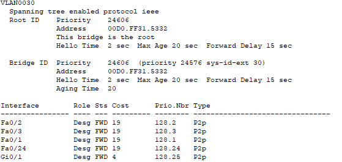

---

### DCHP

В данном примере показан Router 1, который находиться в городе Ижевск

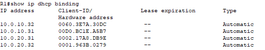

В данном примере показан Router 3, который находиться в городе Москва

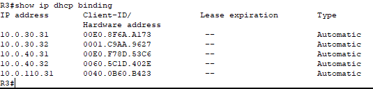

Два пк из разных городов для примера работы:

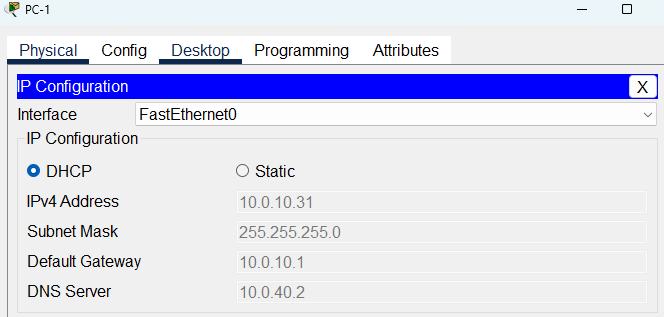

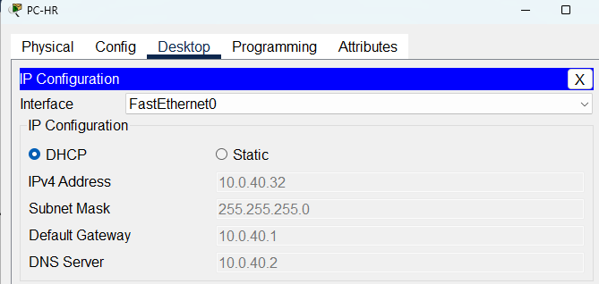

---

### NAT

Тест пинга с PC-1 в городе Ижевск

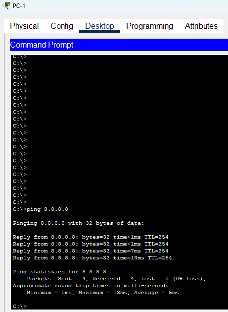

Пример работы NAT на Router 1 в городе Ижевск

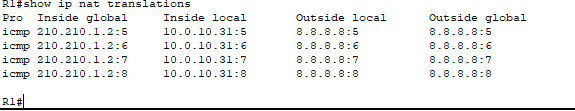

Статистика NAT на Router 1 в городе Ижевск

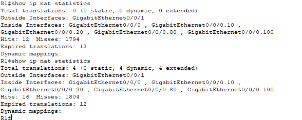

---

### ACL (ограничение доступа)

Тест пинга другой подсети из офиса в Москве, попытка увидеть хост из другого отдела. 

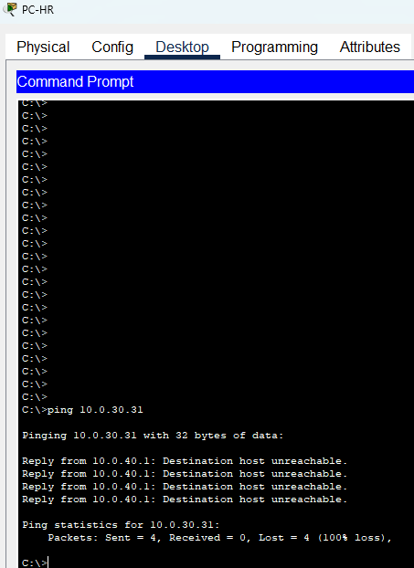

Попытка увидеть хост в своей подсети

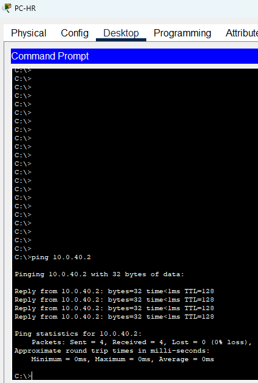

Список ACL HR-BLOCK-ACC на Roter 3 в городе Москва

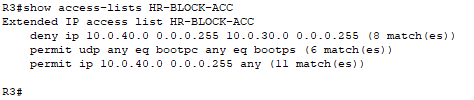

---

### SSH

Подключение по SSH к Router 3 в Москве, через компьютер в необходимой подсети

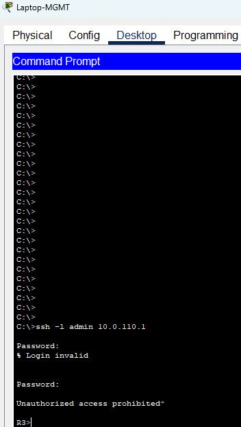

Настройка SSH на Router 3 в Москве 

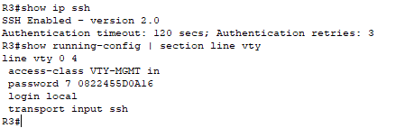

### VPN

Пинг DNS сервера с компьютера в Ижевске

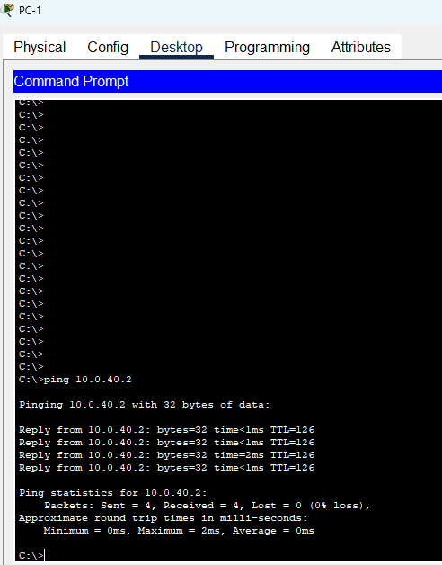

Таблица ISAKMP/IKE Security Associations на Router 1 в Ижевске

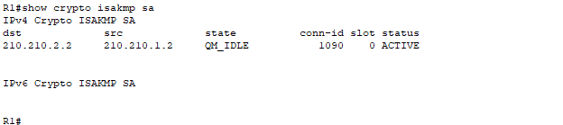

---

  
Заключение

### Заключение

---

  
Проделанная работа

### Проделанная работа

В ходе работы была спроектирована и реализована сеть малого предприятия с двумя офисами (Ижевск и Москва) в среде Cisco Packet Tracer. Сеть сегментирована с помощью VLAN, обеспечена корректная работа L2-инфраструктуры за счёт PVST и trunk-соединений. Для автоматизации настройки хостов настроен DHCP, для выхода в сеть провайдера выполнен NAT (PAT) с исключением межофисного трафика. Между офисами реализован защищённый канал связи Site-to-Site VPN на базе IPsec, подтверждённый активными SA и счётчиками шифрования. Также настроены ACL для реализации политики безопасности между отделами и SSH для безопасного удалённого управления сетевыми устройствами. Проведённые тесты подтверждают корректную работу всех заявленных функций.

---

  
Итоговая таблица

### Итоговая таблица

| Что проверяем                  | Команда / действие                                                                                  | Доказательство                                         |
|--------------------------------|------------------------------------------------------------------------------------------------------|-------------------------------------------------------------------------------|
| VLAN созданы                   | `show vlan brief` (SW3, SW4)                                                                         | Видны VLAN 10/20/80/100 и 30/40/110                              |
| Trunk работает                 | `show interfaces trunk` (SW3, SW4)                                                                   | Trunking, разрешены нужные VLAN                                   |
| PVST работает                  | `show spanning-tree vlan 10` (SW3), `show spanning-tree vlan 30` (SW4)                              | STP активен, root определён                                       |
| DHCP раздаёт адреса            | `show ip dhcp binding` (R1, R3)                                                                      | Есть bindings, ПК получают IP                                   |
| NAT работает                   | PC1: `ping 8.8.8.8`; R1: `show ip nat translations`, `show ip nat statistics`                        | Ping успешен, есть трансляции                                   |
| ACL блокирует HR→Acc           | PC‑HR: `ping <IP PC‑Acc1>`                                                                          | Ping blocked                                                    |
| ACL разрешает HR→DNS           | PC‑HR: `ping 10.0.40.2`                                                                             | Ping successful                                                  |
| SSH включён                    | Laptop‑Msk‑MGMT: `ssh -l admin 10.0.110.1`; R3: `show ip ssh`                                        | Удалённый доступ по SSH                                        |
| VPN установлен и шифрует       | PC1: `ping 10.0.40.2`; R1: `show crypto isakmp sa`, `show crypto ipsec sa`                          | SA активны, есть ESP и счётчики                             |

---

  
Что планируется улучшать в будущем

### Что планируется улучшать в будущем

+ Резервирование каналов и оборудования: добавить второй WAN/провайдера, второй граничный маршрутизатор, настроить автоматическое переключение (HSRP/VRRP, IP SLA, dual VPN).

+ Динамическая маршрутизация: заменить статические маршруты на OSPF/EIGRP для автоматической адаптации при добавлении новых подсетей и офисов.

+ Централизованная безопасность: внедрить zone-based firewall, IDS/IPS (в реальной сети), унифицировать политики ACL и логирование.

+ Сегментация уровня доступа: добавить отдельные VLAN для Wi‑Fi, гостей, VoIP, видеонаблюдения; использовать Private VLAN или более тонкие ACL.

+ AAA и управление доступом: подключить RADIUS/TACACS+ вместо локальных пользователей, разграничить роли администраторов (RBAC).

+ Мониторинг и логирование: настроить SNMP, Syslog, NTP, NetFlow; централизованный сервер мониторинга (Zabbix/PRTG).

+ IP-планирование и масштабирование адресов: перейти на более крупные блоки адресации (суммаризация), подготовить внедрение IPv6 (dual-stack).

+ Отказоустойчивость L2/L3: использовать EtherChannel, продумать root/secondary по PVST, при росте — перейти на L3-доступ.

---

---
