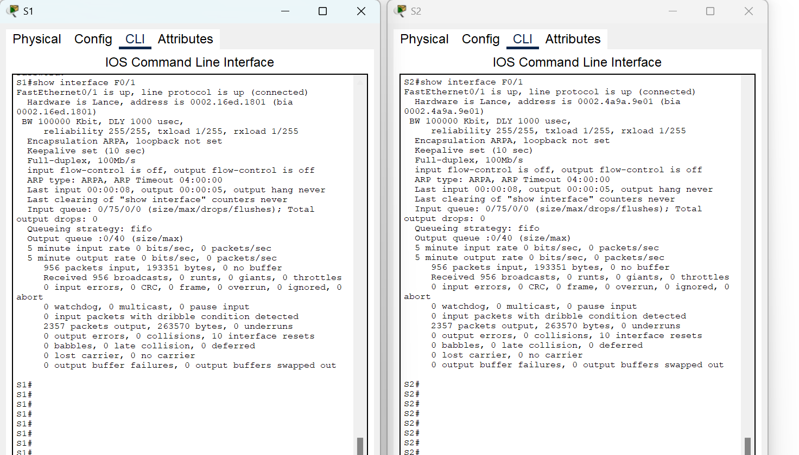

Лабораторная работа. Просмотр таблицы MAC-адресов коммутатора 

Топология

    Таблица адресации

| Устройство | Интерфейс | IP-адрес | Маска подсети |
|--|--|--|--|
| S1 | VLAN 1| 192.168.1.11 | 255.255.255.0 |
| S2 | VLAN 1 | 192.168.1.11 | 255.255.255.0 |
| PC-A | NIC | 192.168.1.11 | 255.255.255.0 |
| PC-B | NIC | 192.168.1.11 | 255.255.255.0 |

### Часть 1. Создание и настройка сети
### Часть 2. Изучение таблицы МАС-адресов коммутатора

_________________

# Часть 1. Создание и настройка сети
Шаг 1. Подключите сеть в соответствии с топологией.
Шаг 2. Настройте узлы ПК.
Шаг 3. Выполните инициализацию и перезагрузку коммутаторов.
Шаг 4. Настройте базовые параметры каждого коммутатора.

Откройте окно конфигурации
a.	Настройте имена устройств в соответствии с топологией.
b.	Настройте IP-адреса, как указано в таблице адресации.
c.	Назначьте cisco в качестве паролей консоли и VTY.
d.	Назначьте class в качестве пароля доступа к привилегированному режиму EXEC.

___

    Необходимые ресурсы
    •2 коммутатора (Cisco 2960 с операционной системой Cisco IOS 15.2(2) (образ lanbasek9) или аналогичная модель)
    •2 ПК (Windows и программа эмуляции терминала, такая как Tera Term)
    •Консольные кабели для настройки устройств Cisco IOS через консольные порты.
    •Кабели Ethernet, расположенные в соответствии с топологией
    Примечание. Интерфейсы Fast Ethernet на коммутаторах Cisco 2960 определяют тип подключения автоматически, поэтому между коммутаторами S1 и S2 можно использовать прямой кабель Ethernet. При использовании коммутатора Cisco другой модели может потребоваться перекрестный кабель Ethernet.

___

# Часть 2. Изучение таблицы МАС-адресов коммутатора

Как только между сетевыми устройствами начинается передача данных, коммутатор выясняет МАС-адреса и строит таблицу.

### Шаг 1. Запишите МАС-адреса сетевых устройств.
a.	Откройте командную строку на PC-A и PC-B и введите команду ipconfig /all.
Открытие окна командной строки Windows
Вопрос:
Назовите физические адреса адаптера Ethernet.
MAC-адрес компьютера PC-A и PC-B:  

Закройте окно командной строки.

b.	Подключитесь к коммутаторам S1 и S2 через консоль и введите команду show interface F0/1 на каждом коммутаторе.
Откройте окно конфигурации
Вопросы:
Назовите адреса оборудования во второй строке выходных данных команды (или зашитый адрес — bia).
МАС-адрес коммутатора S1 Fast Ethernet 0/1:
МАС-адрес коммутатора S2 Fast Ethernet 0/1:

___

### Шаг 2. Просмотрите таблицу МАС-адресов коммутатора.
Подключитесь к коммутатору S2 через консоль и просмотрите таблицу МАС-адресов до и после тестирования сетевой связи с помощью эхо-запросов.
a.	Подключитесь к коммутатору S2 через консоль и войдите в привилегированный режим EXEC.
Откройте окно конфигурации
b.	В привилегированном режиме EXEC введите команду show mac address-table и нажмите клавишу ввода.
S2# show mac address-table
Даже если сетевая коммуникация в сети не происходила (т. е. если команда ping не отправлялась), коммутатор может узнать МАС-адреса при подключении к ПК и другим коммутаторам.
Вопросы:
Записаны ли в таблице МАС-адресов какие-либо МАС-адреса?

Какие МАС-адреса записаны в таблице? С какими портами коммутатора они сопоставлены и каким устройствам принадлежат? Игнорируйте МАС-адреса, сопоставленные с центральным процессором.

Если вы не записали МАС-адреса сетевых устройств в шаге 1, как можно определить, каким устройствам принадлежат МАС-адреса, используя только выходные данные команды show mac address-table? Работает ли это решение в любой ситуации?
Нет не возможно.

___

### Шаг 3. Очистите таблицу МАС-адресов коммутатора S2 и снова отобразите таблицу МАС-адресов.

a.	В привилегированном режиме EXEC введите команду clear mac address-table dynamic и нажмите клавишу Enter.
S2# clear mac address-table dynamic

b.	Снова быстро введите команду show mac address-table.
Вопросы:
Указаны ли в таблице МАС-адресов адреса для VLAN 1? 
Ответ: Да
Указаны ли другие МАС-адреса?
Ответ: Да
Через 10 секунд введите команду show mac address-table и нажмите клавишу ввода. Появились ли в таблице МАС-адресов новые адреса?
Ответ Да

___

### Шаг 4. С компьютера PC-B отправьте эхо-запросы устройствам в сети и просмотрите таблицу МАС-адресов коммутатора.
a.	На компьютере PC-B откройте командную строку и еще раз введите команду arp -a.
Откройте командную строку.
Вопрос:
Не считая адресов многоадресной и широковещательной рассылки, сколько пар IP- и МАС-адресов устройств было получено через протокол ARP?

b.	Из командной строки PC-B отправьте эхо-запросы на компьютер PC-A, а также коммутаторы S1 и S2.
Вопрос:
От всех ли устройств получены ответы? Если нет, проверьте кабели и IP-конфигурации.

Закройте командную строку.
c.	Подключившись через консоль к коммутатору S2, введите команду show mac address-table.
Откройте окно конфигурации
Вопрос:
Добавил ли коммутатор в таблицу МАС-адресов дополнительные МАС-адреса? Если да, то какие адреса и устройства?

На компьютере PC-B откройте командную строку и еще раз введите команду arp -a.
Вопрос:
Появились ли в ARP-кэше компьютера PC-B дополнительные записи для всех сетевых устройств, которым были отправлены эхо-запросы?

___

    Вопрос для повторения
    В сетях Ethernet данные передаются на устройства по соответствующим МАС-адресам. Для этого коммутаторы и компьютеры динамически создают ARP-кэш и таблицы МАС-адресов. Если компьютеров в сети немного, эта процедура выглядит достаточно простой. Какие сложности могут возникнуть в крупных сетях?

    Ответ: В крупных сетях, где сотни или тысячи устройств находятся в одной большой плоской сети (в одном broadcast-домене), возникают серьезные проблемы с производительностью, управляемостью и безопасностью:
    Широковещательные штормы (Broadcast Storms): Протокол ARP работает с помощью широковещательных (broadcast) запросов. Когда одно устройство ищет MAC-адрес другого, оно отправляет ARP-запрос всем устройствам в сети. В большой сети количество таких запросов становится огромным. Любое широковещательное сообщение (не только ARP) будет доставлено каждому устройству, потребляя процессорное время каждого хоста и пропускную способность сети. Это может привести к "широковещательному шторму", который парализует работу всей сети.