# Лабораторная работа. Настройка IPv6-адресов на сетевых устройствах

### Топология


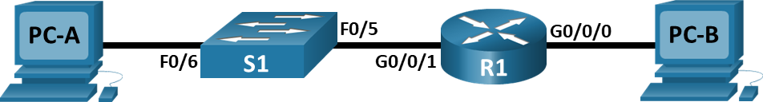


| Устройство | Интерфейс | IPv6-адрес              | Link local IPv6-адрес | Длина префикса | Шлюз по умолчанию |
|------------|-----------|-------------------------|-----------------------|----------------|-------------------|
| R1         | G0/0/0    | 2001:db8:acad:a::1      | fe80::1               | 64             | —                 |
| R1         | G0/0/1    | 2001:db8:acad:1::1      | fe80::1               | 64             | —                 |
| S1         | VLAN 1    | 2001:db8:acad:1::b      | fe80::b               | 64             | —                 |
| PC-A       | NIC       | 2001:db8:acad:1::3      | SLACC                 | 64             | fe80::1           |
| PC-B       | NIC       | 2001:db8:acad:a::3      | SLACC                 | 64             | fe80::1           |

---


## Задачи
### Часть 1. Настройка топологии и конфигурация основных параметров маршрутизатора и коммутатора
### Часть 2. Ручная настройка IPv6-адресов
### Часть 3. Проверка сквозного соединения

## Общие сведения/сценарий
В этой лабораторной работе  вы будете настраивать хосты и интерфейсы устройств с IPv6-адресами.  Для просмотра индивидуальных и групповых IPv6-адресов вы будете использовать команду show. Вы также будете проверять сквозное соединение с помощью команд ping and traceroute.

Примечание: Маршрутизаторы, используемые в практических лабораторных работах CCNA, - это Cisco 4221 с Cisco IOS XE Release 16.9.4 (образ universalk9). В лабораторных работах используются коммутаторы Cisco Catalyst 2960 с Cisco IOS версии 15.2(2) (образ lanbasek9). Можно использовать другие маршрутизаторы, коммутаторы и версии Cisco IOS. В зависимости от модели устройства и версии Cisco IOS доступные команды и результаты их выполнения могут отличаться от тех, которые показаны в лабораторных работах. Правильные идентификаторы интерфейса см. в сводной таблице по интерфейсам маршрутизаторов в конце лабораторной работы.

Примечание:  Убедитесь, что у всех маршрутизаторов и коммутаторов была удалена начальная конфигурация. Если вы не уверены, обратитесь к инструктору.

Примечание. Шаблон по умолчанию менеджера базы данных 2960 Switch Database Manager (SDM) не поддерживает IPv6. Перед назначением IPv6-адреса SVI VLAN 1 может понадобиться выполнение команды sdm prefer dual-ipv4-and-ipv6 default для включения IPv6-адресации.

Примечание. Шаблон default bias, который по умолчанию используется диспетчером SDM (диспетчер базы данных коммутатора), не предоставляет возможностей адресации IPv6. Убедитесь, что SDM использует шаблон dual-ipv4-and-ipv6 или lanbase-routing. Новый шаблон будет использоваться после перезагрузки. 

S1# show sdm prefer
Чтобы установить шаблон dual-ipv4-and-ipv6 в качестве шаблона SDM по умолчанию, выполните следующие действия:
S1# configure terminal
S1(config)# sdm prefer dual-ipv4-and-ipv6 default
S1(config)# end
S1# reload

---

## Необходимые ресурсы
•	1 Маршрутизатор (Cisco 4221 с универсальным образом Cisco IOS XE версии 16.9.4 или аналогичным)

•	1 коммутатор (Cisco 2960 с ПО Cisco IOS версии 15.2(2) с образом lanbasek9 или аналогичная модель)

•	2 ПК (Windows и программа эмуляции терминала, такая как Tera Term)

•	Консольные кабели для настройки устройств Cisco IOS через консольные порты.

•	Кабели Ethernet, расположенные в соответствии с топологией
Примечание. Интерфейсы Gigabit Ethernet на маршрутизаторах Cisco 4221 определяют скорость автоматически, поэтому для подключения маршрутизатора к PC-B можно использовать прямой кабель Ethernet. При использовании другой модели маршрутизатора Cisco может возникнуть необходимость использовать перекрестный кабель Ethernet.

---


# Часть 1. Настройка топологии и конфигурация основных параметров маршрутизатора и коммутатора

## После подключения сети, инициализации и перезагрузки маршрутизатора и коммутатора выполните следующие действия:

Шаг 1. Настройте маршрутизатор.
Назначьте имя хоста и настройте основные параметры устройства.
```
enable
configure terminal
hostname R1
no ip domain-lookup
```
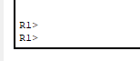

---
Шаг 2. Настройте коммутатор.
Назначьте имя хоста и настройте основные параметры устройства.
```
enable
configure terminal
hostname S1
no ip domain-lookup
```

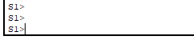

---

# Часть 2. Ручная настройка IPv6-адресов

## Шаг 1. Назначьте IPv6-адреса интерфейсам Ethernet на R1.


---
a.	Назначьте глобальные индивидуальные IPv6-адреса, указанные в таблице адресации обоим интерфейсам Ethernet на R1.
Откройте окно конфигурации

b.	Введите команду show ipv6 interface brief, чтобы проверить, назначен ли каждому интерфейсу корректный индивидуальный IPv6-адрес.
Примечание. Отображаемый локальный адрес канала основан на адресации EUI-64, которая автоматически использует MAC-адрес интерфейса для создания 128-битного локального IPv6-адреса канала.

c.	Чтобы обеспечить соответствие локальных адресов канала индивидуальному адресу, вручную введите локальные адреса канала на каждом интерфейсе Ethernet на R1.

Примечание. Каждый интерфейс маршрутизатора относится к отдельной сети. Пакеты с локальным адресом канала никогда не выходят за пределы локальной сети, а значит, для обоих интерфейсов можно указывать один и тот же локальный адрес канала.

d.	Используйте выбранную команду, чтобы убедиться, что локальный адрес связи изменен на fe80::1.  

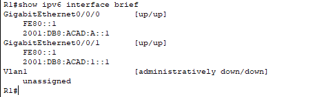


---
Закройте окно настройки.
Вопрос:
```
Какие группы многоадресной рассылки назначены интерфейсу G0/0?
```

Ответ:
```
Для интерфейса с глобальным IPv6-адресом типа unicast и после включения IPv6 unicast-routing отображаются группы:

ff02::1 (all-nodes multicast group / все узлы)
ff02::1:ffxx
(solicited-node адрес для IPv6 адреса этого интерфейса)
ff02::2 (all-routers multicast group / все маршрутизаторы) – появляется после включения ipv6 unicast-routing
Посмотреть их можно через show ipv6 interface g0/0/0.
```
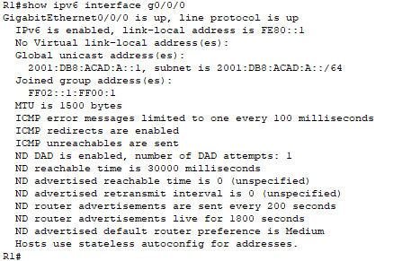

---

## Шаг 2. Активируйте IPv6-маршрутизацию на R1.
a.	В командной строке на PC-B введите команду ipconfig, чтобы получить данные IPv6-адреса, назначенного интерфейсу ПК.

Вопрос:
```
Назначен ли индивидуальный IPv6-адрес сетевой интерфейсной карте (NIC) на PC-B?
```
Ответ:
```
Нет, до включения ipv6 unicast-routing на R1 индивидуальный IPv6-адрес не назначается по SLAAC, потому что R1 не выполняет функцию маршрутизатора и не рассылет Router Advertisement (RA). 
После включения этой команды (и если на R1 активны IPv6-интерфейсы), PC-B автоматически - по SLAAC - получает индивидуальный IPv6-адрес с корректным префиксом от R1.
```

b.	Активируйте IPv6-маршрутизацию на R1 с помощью команды IPv6 unicast-routing, чтобы убедиться, что новая многоадресная группа назначена интерфейсу G0/0/0. Обратите внимание, что в списке групп для интерфейса G0/0 отображается группа многоадресной рассылки всех маршрутизаторов (FF02::2).

Примечание. Это позволит компьютерам получать IP-адреса и данные шлюза по умолчанию с помощью функции SLAAC (Stateless Address Autoconfiguration (Автоконфигурация без сохранения состояния адреса)).

c.	Теперь, когда R1 входит в группу многоадресной рассылки всех маршрутизаторов, еще раз введите команду ipconfig на PC-B. Проверьте данные IPv6-адреса.

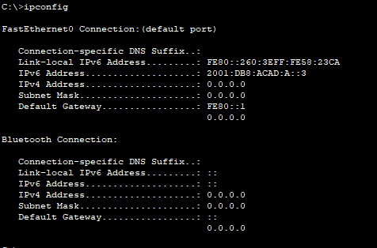

Вопрос:
```
Почему PC-B получил глобальный префикс маршрутизации и идентификатор подсети, которые вы настроили на R1?
```
Ответ:
```
Когда на маршрутизаторе активна IPv6-маршрутизация (ipv6 unicast-routing), он начинает рассылать Router Advertisement (RA) по соответствующим интерфейсам. ПК, получив этот RA, по протоколу SLAAC самостоятельно формирует глобальный IPv6-адрес, используя префикс и ID подсети, указанные на интерфейсе маршрутизатора (в нашем случае: 2001:db8:acad:a::/64 для PC-B).
```


---
## Шаг 3. Назначьте IPv6-адреса интерфейсу управления (SVI) на S1.
a.	Назначьте адрес IPv6 для S1. Также назначьте этому интерфейсу локальный адрес канала fe80::b.
b.	Проверьте правильность назначения IPv6-адресов интерфейсу управления с помощью команды show ipv6 interface vlan1.
Закройте окно настройки.
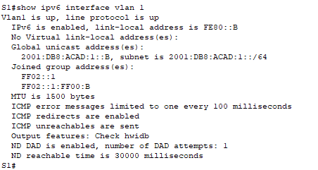

---
## Шаг 4. Назначьте компьютерам статические IPv6-адреса.
a.	Откройте окно Свойства Ethernet для каждого ПК и назначьте адресацию IPv6.
Убедитесь, что оба компьютера имеют правильную информацию адреса IPv6
Примечание. При выполнении работы в среде Cisco Packet Tracer установите статический и SLACC адреса на компьютеры последовательно, отразив результаты в отчете
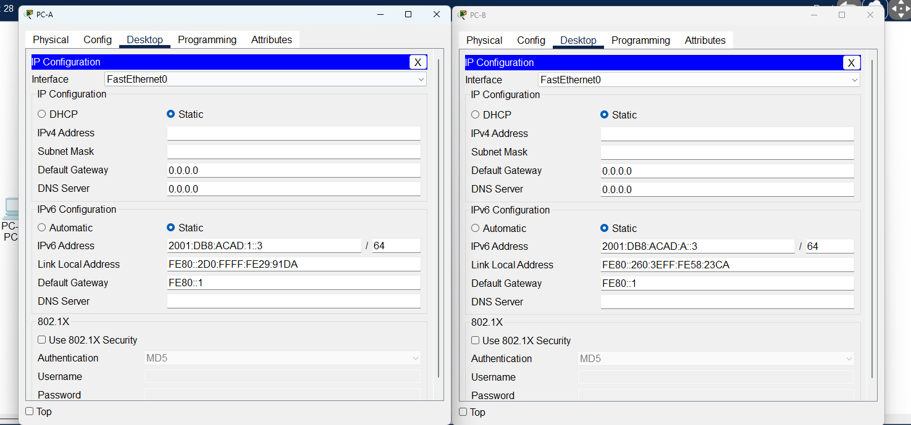


---


# Часть 3. Проверка сквозного подключения

С PC-A отправьте эхо-запрос на FE80::1. Это локальный адрес канала, назначенный G0/1 на R1.
Отправьте эхо-запрос на интерфейс управления S1 с PC-A.
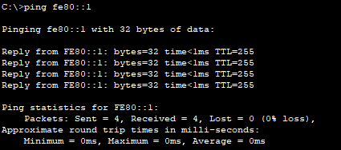

---
Введите команду tracert на PC-A, чтобы проверить наличие сквозного подключения к PC-B.
С PC-B отправьте эхо-запрос на PC-A.
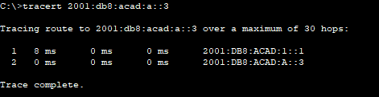


---
С PC-B отправьте эхо-запрос на локальный адрес канала G0/0 на R1.
Примечание.  В случае отсутствия сквозного подключения проверьте, правильно ли указаны IPv6-адреса на всех устройствах.

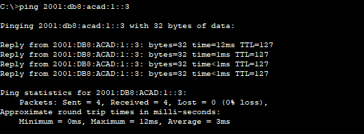