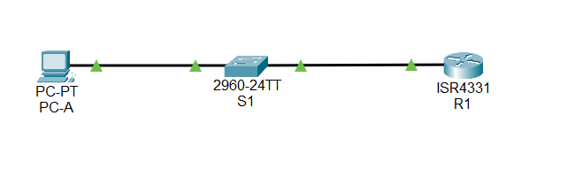
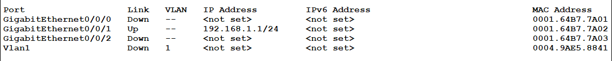
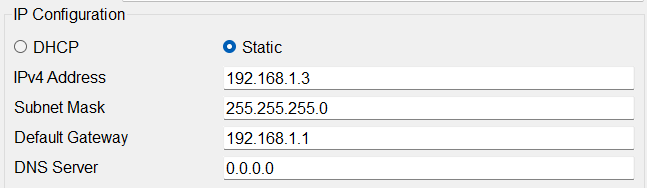
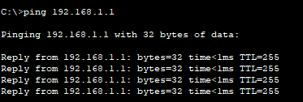
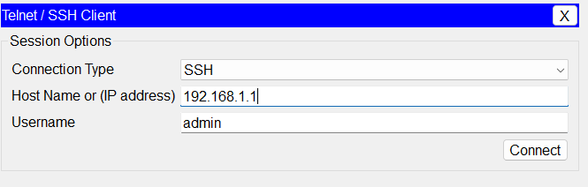
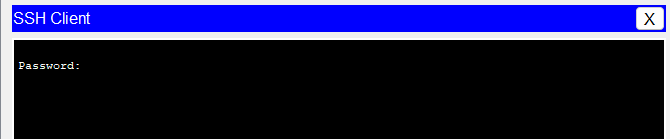
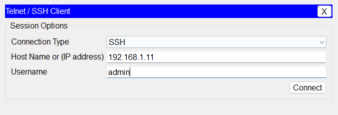
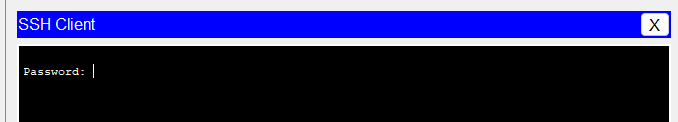
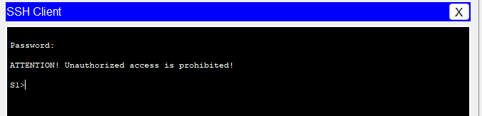
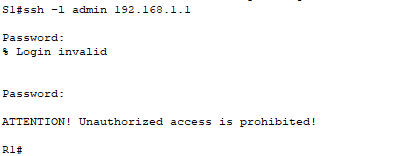

# Лабораторная работа. Доступ к сетевым устройствам по протоколу SSH

### Топология


### Таблица адресации

| Устройство | Интерфейс | IP-адрес      | Маска подсети    | Шлюз по умолчанию |
|:----------:|:---------:|:-------------:|:----------------:|:-----------------:|
| R1         | G0/0/1    | 192.168.1.1   | 255.255.255.0    | —                 |
| S1         | VLAN 1    | 192.168.1.11  | 255.255.255.0    | 192.168.1.1       |
| PC-A       | NIC       | 192.168.1.3   | 255.255.255.0    | 192.168.1.1       |

---

### Задачи
Часть 1. Настройка основных параметров устройства
Часть 2. Настройка маршрутизатора для доступа по протоколу SSH
Часть 3. Настройка коммутатора для доступа по протоколу SSH
Часть 4. SSH через интерфейс командной строки (CLI) коммутатора

---

### Общие сведения/сценарий

Раньше для удаленной настройки сетевых устройств в основном применялся протокол Telnet. Однако он не обеспечивает шифрование информации, передаваемой между клиентом и сервером, что позволяет анализаторам сетевых пакетов перехватывать пароли и данные конфигурации.

Secure Shell (SSH) — это сетевой протокол, устанавливающий безопасное подключение с эмуляцией терминала к маршрутизатору или иному сетевому устройству. Протокол SSH шифрует все сведения, которые поступают по сетевому каналу, и предусматривает аутентификацию удаленного компьютера. Протокол SSH все больше заменяет Telnet — именно его выбирают сетевые специалисты в качестве средства удаленного входа в систему. SSH чаще всего используется для входа на удаленное устройство и выполнения команд. 
Но это может также передавать файлы по связанным протоколам SFTP или SCP.
Чтобы протокол SSH мог работать, на сетевых устройствах, взаимодействующих между собой, должна быть настроена поддержка SSH. В этой лабораторной работе необходимо включить SSH-сервер на маршрутизаторе, после чего подключиться к этому маршрутизатору, используя ПК с установленным клиентом SSH. В локальной сети подключение обычно устанавливается с помощью Ethernet и IP.

Примечание: Маршрутизаторы, используемые в практических лабораторных работах CCNA, - это Cisco 4221 с Cisco IOS XE Release 16.9.4 (образ universalk9). В лабораторных работах используются коммутаторы Cisco Catalyst 2960 с Cisco IOS версии 15.2(2) (образ lanbasek9). Можно использовать другие маршрутизаторы, коммутаторы и версии Cisco IOS. В зависимости от модели устройства и версии Cisco IOS доступные команды и результаты их выполнения могут отличаться от тех, которые показаны в лабораторных работах. Правильные идентификаторы интерфейса см. в сводной таблице по интерфейсам маршрутизаторов в конце лабораторной работы.
Примечание:  Убедитесь, что у всех маршрутизаторов и коммутаторов была удалена начальная конфигурация. Если вы не уверены, обратитесь к инструктору.

#### Необходимые ресурсы
•	1 Маршрутизатор (Cisco 4221 с универсальным образом Cisco IOS XE версии 16.9.4 или аналогичным)
•	1 коммутатор (Cisco 2960 с ПО Cisco IOS версии 15.2(2) с образом lanbasek9 или аналогичная модель)
•	1 ПК (под управлением Windows с программой эмуляции терминала, например, Tera Term)
•	Консольные кабели для настройки устройств Cisco IOS через консольные порты.
•	Кабели Ethernet, расположенные в соответствии с топологией

---

### Часть 1. Настройка основных параметров устройств

В части 1 потребуется настроить топологию сети и основные параметры, такие как IP-адреса интерфейсов, доступ к устройствам и пароли на маршрутизаторе.

---
Шаг 1. Создайте сеть согласно топологии.


---
Шаг 2. Выполните инициализацию и перезагрузку маршрутизатора и коммутатора.


---
Шаг 3. Настройте маршрутизатор.
Откройте окно конфигурации

a.	Подключитесь к маршрутизатору с помощью консоли и активируйте привилегированный режим EXEC.
b.	Войдите в режим конфигурации.
c.	Отключите поиск DNS, чтобы предотвратить попытки маршрутизатора неверно преобразовывать введенные команды таким образом, как будто они являются именами узлов.
d.	Назначьте class в качестве зашифрованного пароля привилегированного режима EXEC.
e.	Назначьте cisco в качестве пароля консоли и включите вход в систему по паролю.
f.	Назначьте cisco в качестве пароля VTY и включите вход в систему по паролю.
g.	Зашифруйте открытые пароли.
h.	Создайте баннер, который предупреждает о запрете несанкционированного доступа.

i.	Настройте и активируйте на маршрутизаторе интерфейс G0/0/1, используя информацию, приведенную в таблице адресации.
j.	Сохраните текущую конфигурацию в файл загрузочной конфигурации.



---
Шаг 4. Настройте компьютер PC-A.
a.	Настройте для PC-A IP-адрес и маску подсети.
b.	Настройте для PC-A шлюз по умолчанию.


---
Шаг 5. Проверьте подключение к сети.
Пошлите с PC-A команду Ping на маршрутизатор R1. Если эхо-запрос с помощью команды ping не проходит, найдите и устраните неполадки подключения.



---


### Часть 2. Настройка маршрутизатора для доступа по протоколу SSH
Подключение к сетевым устройствам по протоколу Telnet сопряжено с риском для безопасности, поскольку вся информация передается в виде открытого текста. Протокол SSH шифрует данные сеанса и обеспечивает аутентификацию устройств, поэтому для удаленных подключений рекомендуется использовать именно этот протокол. В части 2 вам нужно настроить маршрутизатор для приема соединений SSH по линиям VTY.

---

Шаг 1. Настройте аутентификацию устройств.
При генерации ключа шифрования в качестве его части используются имя устройства и домен. Поэтому эти имена необходимо указать перед вводом команды crypto key.
Откройте окно конфигурации
a.	Задайте имя устройства.
b.	Задайте домен для устройства.
```
hostname S1
ip domain-name example.local
```
---
Шаг 2. Создайте ключ шифрования с указанием его длины.
```
crypto key generate rsa - я выбрал 1024 бит
```
---
Шаг 3. Создайте имя пользователя в локальной базе учетных записей.
Настройте имя пользователя, используя admin в качестве имени пользователя и Adm1nP @55 в качестве пароля.
```
username admin privilege 15 secret Adm1nP@55
```
---
Шаг 4. Активируйте протокол SSH на линиях VTY.
a.	Активируйте протоколы Telnet и SSH на входящих линиях VTY с помощью команды transport input.
b.	Измените способ входа в систему таким образом, чтобы использовалась проверка пользователей по локальной базе учетных записей.
```
line vty 0 4
transport input ssh telnet
login local
```
---
Шаг 5. Сохраните текущую конфигурацию в файл загрузочной конфигурации.

```
write memory
```

---
Шаг 6. Установите соединение с маршрутизатором по протоколу SSH.
a.	Запустите Tera Term с PC-A.
b.	Установите SSH-подключение к R1. Use the username admin and password Adm1nP@55. У вас должно получиться установить SSH-подключение к R1.





---

### Часть 3. Настройка коммутатора для доступа по протоколу SSH

В части 3 вам предстоит настроить коммутатор для приема подключений по протоколу SSH, а затем установить SSH-подключение с помощью программы Tera Term.

---
Все шаги по настройке ижентичны шагам в маршрутизаторе

Шаг 3. Установите соединение с коммутатором по протоколу SSH.
Запустите программу Tera Term на PC-A, затем установите подключение по протоколу SSH к интерфейсу SVI коммутатора S1.





---
Вопрос:
```
Удалось ли вам установить SSH-соединение с коммутатором?
```
Ответ:
```
Да
```

---

### Часть 4. Настройка протокола SSH с использованием интерфейса командной строки (CLI) коммутатора

Клиент SSH встроен в операционную систему Cisco IOS и может запускаться из интерфейса командной строки. В части 4 вам предстоит установить соединение с маршрутизатором по протоколу SSH, используя интерфейс командной строки коммутатора.

---

Шаг 1. Посмотрите доступные параметры для клиента SSH в Cisco IOS.
Откройте окно конфигурации
Используйте вопросительный знак (?), чтобы отобразить варианты параметров для команды ssh.
S1# ssh? 
  -c Select encryption algorithm
  -l Log in using this user name
  -m Select HMAC algorithm
  -o Specify options
  -p Connect to this port
  -v Specify SSH Protocol Version
  -vrf Specify vrf name
  WORD IP-адрес или имя хоста удаленной системы


---

Шаг 2. Установите с коммутатора S1 соединение с маршрутизатором R1 по протоколу SSH.

a.	Чтобы подключиться к маршрутизатору R1 по протоколу SSH, введите команду –l admin. Это позволит вам войти в систему под именем admin. При появлении приглашения введите в качестве пароля Adm1nP@55
S1# ssh -l admin 192.168.1.1
Password: 
Authorized Users Only!
R1>
b.	Чтобы вернуться к коммутатору S1, не закрывая сеанс SSH с маршрутизатором R1, нажмите комбинацию клавиш Ctrl+Shift+6. Отпустите клавиши Ctrl+Shift+6 и нажмите x. Отображается приглашение привилегированного режима EXEC коммутатора.
R1>
S1#
c.	Чтобы вернуться к сеансу SSH на R1, нажмите клавишу Enter в пустой строке интерфейса командной строки. Чтобы увидеть окно командной строки маршрутизатора, нажмите клавишу Enter еще раз.
S1#
[Resuming connection 1 to 192.168.1.1 ... ]

R1>
d.	Чтобы завершить сеанс SSH на маршрутизаторе R1, введите в командной строке маршрутизатора команду exit.
R1# exit

[Connection to 192.168.1.1 closed by foreign host]
S1#





---

Вопрос:
```
Какие версии протокола SSH поддерживаются при использовании интерфейса командной строки?
```

Ответ:
```
Поддерживаются версии SSH1 и SSH2. Обычно задается командой ip ssh version 2 для использования SSHv2, который безопаснее и предпочтительнее.
```

Вопрос для повторения
```
Как предоставить доступ к сетевому устройству нескольким пользователям, у каждого из которых есть собственное имя пользователя?
```

Ответ:
```
Для этого нужно создать для каждого пользователя отдельную учетную запись в локальной базе. На линиях VTY командой login local включить проверку по локальной базе.
```