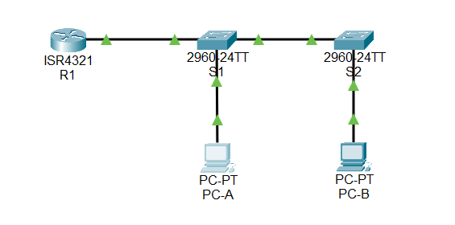
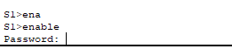
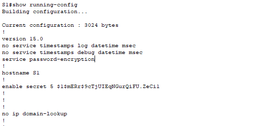
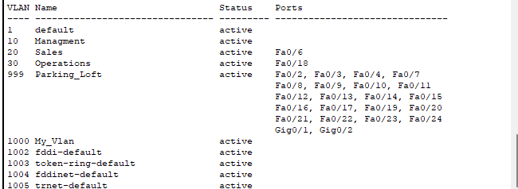
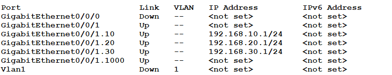
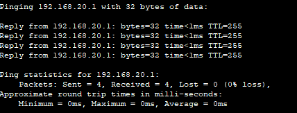
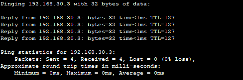
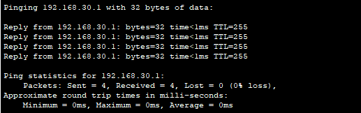
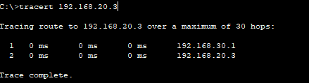

# Лабораторная работа - Внедрение маршрутизации между виртуальными локальными сетями


 

---
## Таблица адресации
| Устройство | Интерфейс      | IP-адрес        | Маска подсети    | Шлюз по умолчанию |
|------------|----------------|-----------------|------------------|-------------------|
| R1         | G0/0/1.10      | 192.168.10.1    | 255.255.255.0    | —                 |
| R1         | G0/0/1.20      | 192.168.20.1    | 255.255.255.0    | —                 |
| R1         | G0/0/1.30      | 192.168.30.1    | 255.255.255.0    | —                 |
| R1         | G0/0/1.1000    | —               | —                | —                 |
| S1         | VLAN 10        | 192.168.10.11   | 255.255.255.0    | 192.168.10.1      |
| S2         | VLAN 10        | 192.168.10.12   | 255.255.255.0    | 192.168.10.1      |
| PC-A       | NIC            | 192.168.20.3    | 255.255.255.0    | 192.168.20.1      |
| PC-B       | NIC            | 192.168.30.3    | 255.255.255.0    | 192.168.30.1      |

---

## Таблица VLAN

| VLAN | Имя         | Назначенный интерфейс                                         |
|------|-------------|---------------------------------------------------------------|
| 10   | Управление  | S1: VLAN 10, S2: VLAN 10                                      |
| 20   | Sales       | S1: F0/6                                                      |
| 30   | Operations  | S2: F0/18                                                     |
| 999  | Parking_Lot | S1: F0/2-4, F0/7-24, G0/1-2; S2: F0/2-17, F0/19-24, G0/1-2     |
| 1000 | Собственная | —                                                             |

---

## Задачи
Часть 1. Создание сети и настройка основных параметров устройства
Часть 2. Создание сетей VLAN и назначение портов коммутатора
Часть 3. Настройка транка 802.1Q между коммутаторами.
Часть 4. Настройка маршрутизации между сетями VLAN
Часть 5. Проверка, что маршрутизация между VLAN работает

---

## Общие сведения/сценарий
В целях повышения производительности сети большие широковещательные домены 2-го уровня делят на домены меньшего размера. Для этого современные коммутаторы используют виртуальные локальные сети (VLAN). VLAN также можно использовать в качестве меры безопасности, отделяя конфиденциальный трафик данных от остальной части сети. Сети VLAN облегчают процесс проектирования сети, обеспечивающей помощь в достижении целей организации. Для связи между VLAN требуется устройство, работающее на уровне 3 модели OSI. Добавление маршрутизации между VLAN позволяет организации разделять и разделять широковещательные домены, одновременно позволяя им обмениваться данными друг с другом.

Транковые каналы сети VLAN используются для распространения сетей VLAN по различным устройствам. Транковые каналы разрешают передачу трафика из множества сетей VLAN через один канал, не нанося вред идентификации и сегментации сети VLAN. Особый вид маршрутизации между VLAN, называемый «Router-on-a-Stick», использует магистраль от маршрутизатора к коммутатору, чтобы все VLAN могли переходить к маршрутизатору.
В этой лабораторной работе вы создадите VLAN на обоих коммутаторах в топологии, назначите VLAN для коммутации портов доступа, убедитесь, что VLAN работают должным образом, создадите транки VLAN между двумя коммутаторами и между S1 и R1, и настройте маршрутизацию между VLAN на R1 для разрешения связи между хостами в разных VLAN независимо от подсети, в которой находится хост.

Примечание: Маршрутизаторы, используемые в практических лабораторных работах CCNA, - это Cisco 4221 с Cisco IOS XE Release 16.9.4 (образ universalk9). В лабораторных работах используются коммутаторы Cisco Catalyst 2960 с Cisco IOS версии 15.2(2) (образ lanbasek9). Можно использовать другие маршрутизаторы, коммутаторы и версии Cisco IOS. В зависимости от модели устройства и версии Cisco IOS доступные команды и результаты их выполнения могут отличаться от тех, которые показаны в лабораторных работах. Правильные идентификаторы интерфейса см. в сводной таблице по интерфейсам маршрутизаторов в конце лабораторной работы.

Примечание. Убедитесь, что у всех маршрутизаторов и коммутаторов была удалена начальная конфигурация. Если вы не уверены в этом, обратитесь к инструктору.


---

## Необходимые ресурсы
•	1 Маршрутизатор (Cisco 4221 с универсальным образом Cisco IOS XE версии 16.9.4 или аналогичным)
•	2 коммутатора (Cisco 2960 с операционной системой Cisco IOS 15.2(2) (образ lanbasek9) или аналогичная модель)
•	2 ПК (ОС Windows с программой эмуляции терминалов, такой как Tera Term)
•	Консольные кабели для настройки устройств Cisco IOS через консольные порты.
•	Кабели Ethernet, расположенные в соответствии с топологией

---

## Часть 1. Создание сети и настройка основных параметров устройства

В первой части лабораторной работы вам предстоит создать топологию сети и настроить базовые параметры для узлов ПК и коммутаторов.
Шаг 1. Создайте сеть согласно топологии.
Подключите устройства, как показано в топологии, и подсоедините необходимые кабели.


---
Шаг 2. Настройте базовые параметры для маршрутизатора.
a.	Подключитесь к маршрутизатору с помощью консоли и активируйте привилегированный режим EXEC.
Откройте окно конфигурации
b.	Войдите в режим конфигурации.
c.	Назначьте маршрутизатору имя устройства.
d.	Отключите поиск DNS, чтобы предотвратить попытки маршрутизатора неверно преобразовывать введенные команды таким образом, как будто они являются именами узлов.
e.	Назначьте class в качестве зашифрованного пароля привилегированного режима EXEC.

f.	Назначьте cisco в качестве пароля консоли и включите вход в систему по паролю.
g.	Установите cisco в качестве пароля виртуального терминала и активируйте вход.


h.	Зашифруйте открытые пароли.

i.	Создайте баннер с предупреждением о запрете несанкционированного доступа к устройству.
j.	Сохраните текущую конфигурацию в файл загрузочной конфигурации.
k.	Настройте на маршрутизаторе время.

Закройте окно настройки.


---
Шаг 3. Настройте базовые параметры каждого коммутатора.
a.	Присвойте коммутатору имя устройства.

b.	Отключите поиск DNS, чтобы предотвратить попытки маршрутизатора неверно преобразовывать введенные команды таким образом, как будто они являются именами узлов.
c.	Назначьте class в качестве зашифрованного пароля привилегированного режима EXEC.
d.	Назначьте cisco в качестве пароля консоли и включите вход в систему по паролю.


e.	Установите cisco в качестве пароля виртуального терминала и активируйте вход.

f.	Зашифруйте открытые пароли.

g.	Создайте баннер с предупреждением о запрете несанкционированного доступа к устройству.
h.	Настройте на коммутаторах время.

i.	Сохранение текущей конфигурации в качестве начальной.
Закройте окно настройки.

---
Шаг 4. Настройте узлы ПК.
Адреса ПК можно посмотреть в таблице адресации.


---

## Часть 2. Создание сетей VLAN и назначение портов коммутатора

Во второй части вы создадите VLAN, как указано в таблице выше, на обоих коммутаторах. Затем вы назначите VLAN соответствующему интерфейсу и проверите настройки конфигурации. Выполните следующие задачи на каждом коммутаторе.
Шаг 1. Создайте сети VLAN на коммутаторах.
a.	Создайте и назовите необходимые VLAN на каждом коммутаторе из таблицы выше.
Откройте окно конфигурации
b.	Настройте интерфейс управления и шлюз по умолчанию на каждом коммутаторе, используя информацию об IP-адресе в таблице адресации. 
c.	Назначьте все неиспользуемые порты коммутатора VLAN Parking_Lot, настройте их для статического режима доступа и административно деактивируйте их.
Примечание. Команда interface range полезна для выполнения этой задачи с минимальным количеством команд.


---
Шаг 2. Назначьте сети VLAN соответствующим интерфейсам коммутатора.
a.	Назначьте используемые порты соответствующей VLAN (указанной в таблице VLAN выше) и настройте их для режима статического доступа.
b.	Убедитесь, что VLAN назначены на правильные интерфейсы.
Закройте окно настройки.


---

## Часть 3. Конфигурация магистрального канала стандарта 802.1Q между коммутаторами

В части 3 вы вручную настроите интерфейс F0/1 как транк.
Шаг 1. Вручную настройте магистральный интерфейс F0/1 на коммутаторах S1 и S2.
a.	Настройка статического транкинга на интерфейсе F0/1 для обоих коммутаторов.
Откройте окно конфигурации
b.	Установите native VLAN 1000 на обоих коммутаторах.
c.	Укажите, что VLAN 10, 20, 30 и 1000 могут проходить по транку.
d.	Проверьте транки, native VLAN и разрешенные VLAN через транк.
Шаг 2. Вручную настройте магистральный интерфейс F0/5 на коммутаторе S1.
a.	Настройте интерфейс S1 F0/5 с теми же параметрами транка, что и F0/1. Это транк до маршрутизатора.
b.	Сохраните текущую конфигурацию в файл загрузочной конфигурации.
c.	Проверка транкинга.
Вопрос:
```Что произойдет, если G0/0/1 на R1 будет отключен?```
Ответ:
```Между VLAN не будет связи. Хосты в одной VLAN смогут общаться друг с другом, но не с другими VLAN.```
Закройте окно настройки.

Ключевые команды для настройки:

```plaintext
interface fa0/1
 switchport mode trunk
 switchport trunk native vlan 1000
 switchport trunk allowed vlan 10,20,30,1000
 no shutdown
 exit

interface fa0/5
 switchport mode trunk
 switchport trunk native vlan 1000
 switchport trunk allowed vlan 10,20,30,1000
 no shutdown
 exit
```
---


## Часть 4. Настройка маршрутизации между сетями VLAN


Шаг 1. Настройте маршрутизатор.
Откройте окно конфигурации
a.	При необходимости активируйте интерфейс G0/0/1 на маршрутизаторе.
b.	Настройте подинтерфейсы для каждой VLAN, как указано в таблице IP-адресации. Все подинтерфейсы используют инкапсуляцию 802.1Q. Убедитесь, что подинтерфейсу для native VLAN не назначен IP-адрес. Включите описание для каждого подинтерфейса.
c.	Убедитесь, что вспомогательные интерфейсы работают
Закройте окно настройки.


Ключевые команды для настройки на R1:

```
plaintext
interface g0/0/1
 no shutdown
 exit

interface g0/0/1.10
 encapsulation dot1Q 10
 ip address 192.168.10.1 255.255.255.0
 no shutdown
 exit

interface g0/0/1.20
 encapsulation dot1Q 20
 ip address 192.168.20.1 255.255.255.0
 no shutdown
 exit

interface g0/0/1.30
 encapsulation dot1Q 30
 ip address 192.168.30.1 255.255.255.0
 no shutdown
 exit

interface g0/0/1.1000
 encapsulation dot1Q 1000 native
 no shutdown
 exit
 ```


---


## Часть 5. Проверьте, работает ли маршрутизация между VLAN
Шаг 1. Выполните следующие тесты с PC-A. Все должно быть успешно.
Примечание. Возможно, вам придется отключить брандмауэр ПК для работы ping
a.	Отправьте эхо-запрос с PC-A на шлюз по умолчанию.

b.	Отправьте эхо-запрос с PC-A на PC-B.

c.	Отправьте команду ping с компьютера PC-A на коммутатор S2.

Шаг 2. Пройдите следующий тест с PC-B
В окне командной строки на PC-B выполните команду tracert на адрес PC-A.

Вопрос:
Какие промежуточные IP-адреса отображаются в результатах?

192.168.30.1
192.168.20.3

---
