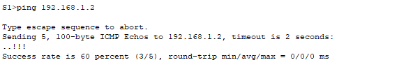
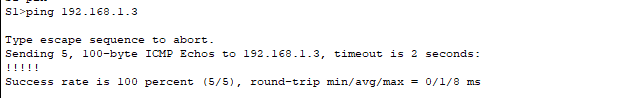
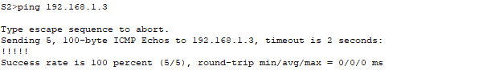
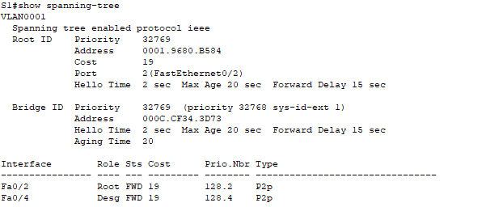
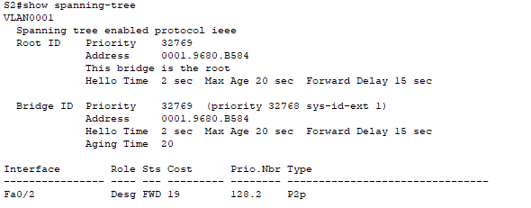
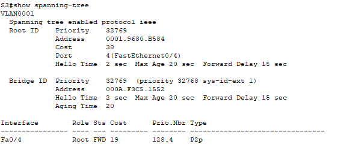
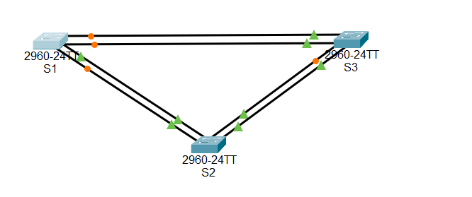
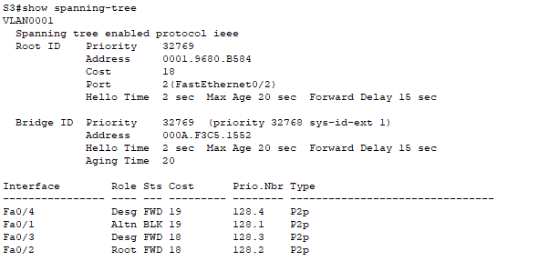
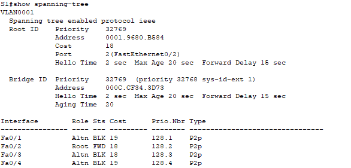

# Лабораторная работа. Развертывание коммутируемой сети с резервными каналами


---

## Таблица адресации
| Устройство | Интерфейс |   IP-адрес     |   Маска подсети    |
|:----------:|:---------:|:--------------:|:------------------:|
|     S1     |  VLAN 1   | 192.168.1.1    | 255.255.255.0      |
|     S2     |  VLAN 1   | 192.168.1.2    | 255.255.255.0      |
|     S3     |  VLAN 1   | 192.168.1.3    | 255.255.255.0      |


## Цели
Часть 1. Создание сети и настройка основных параметров устройства
Часть 2. Выбор корневого моста
Часть 3. Наблюдение за процессом выбора протоколом STP порта, исходя из стоимости портов
Часть 4. Наблюдение за процессом выбора протоколом STP порта, исходя из приоритета портов
	
    
## Общие сведения/сценарий
Избыточность позволяет увеличить доступность устройств в топологии сети за счёт устранения единой точки отказа. Избыточность в коммутируемой сети обеспечивается посредством использования нескольких коммутаторов или нескольких каналов между коммутаторами. Когда в проекте сети используется физическая избыточность, возможно возникновение петель и дублирование кадров.

Протокол spanning-tree (STP) был разработан как механизм предотвращения возникновения петель на 2-м уровне для избыточных каналов коммутируемой сети. Протокол STP обеспечивает наличие только одного логического пути между всеми узлами назначения в сети путем намеренного блокирования резервных путей, которые могли бы вызвать петлю.

В этой лабораторной работе команда show spanning-tree используется для наблюдения за процессом выбора протоколом STP корневого моста. Также вы будете наблюдать за процессом выбора портов с учетом стоимости и приоритета.
Примечание. Используются коммутаторы Cisco Catalyst 2960s с Cisco IOS версии 15.0(2) (образ lanbasek9). Допускается использование других моделей коммутаторов и других версий Cisco IOS. В зависимости от модели устройства и версии Cisco IOS доступные команды и результаты их выполнения могут отличаться от тех, которые показаны в лабораторных работах. 

Примечание. Убедитесь, что все настройки коммутатора удалены и загрузочная конфигурация отсутствует. Если вы не уверены, обратитесь к инструктору.

## Необходимые ресурсы
•	3 коммутатора (Cisco 2960 с операционной системой Cisco IOS 15.0(2) (образ lanbasek9) или аналогичная модель)
•	Консольные кабели для настройки устройств Cisco IOS через консольные порты
•	Кабели Ethernet, расположенные в соответствии с топологией

---

## Часть 1:	Создание сети и настройка основных параметров устройства

В части 1 вам предстоит настроить топологию сети и основные параметры маршрутизаторов.
Шаг 1:	Создайте сеть согласно топологии.
Подключите устройства, как показано в топологии, и подсоедините необходимые кабели.

Шаг 2:	Выполните инициализацию и перезагрузку коммутаторов.
Шаг 3:	Настройте базовые параметры каждого коммутатора.
a.	Отключите поиск DNS.
b.	Присвойте имена устройствам в соответствии с топологией.
c.	Назначьте class в качестве зашифрованного пароля доступа к привилегированному режиму.
d.	Назначьте cisco в качестве паролей консоли и VTY и активируйте вход для консоли и VTY каналов.
e.	Настройте logging synchronous для консольного канала.
f.	Настройте баннерное сообщение дня (MOTD) для предупреждения пользователей о запрете несанкционированного доступа.
g.	Задайте IP-адрес, указанный в таблице адресации для VLAN 1 на всех коммутаторах.
h.	Скопируйте текущую конфигурацию в файл загрузочной конфигурации.
Шаг 4:	Проверьте связь.
Проверьте способность компьютеров обмениваться эхо-запросами.
Успешно ли выполняется эхо-запрос от коммутатора S1 на коммутатор S2?



Успешно ли выполняется эхо-запрос от коммутатора S1 на коммутатор S3?	



Успешно ли выполняется эхо-запрос от коммутатора S2 на коммутатор S3?	



Выполняйте отладку до тех пор, пока ответы на все вопросы не будут положительными.

---

## Часть 2:	Определение корневого моста
Для каждого экземпляра протокола spanning-tree (коммутируемая сеть LAN или широковещательный домен) существует коммутатор, выделенный в качестве корневого моста. Корневой мост служит точкой привязки для всех расчётов протокола spanning-tree, позволяя определить избыточные пути, которые следует заблокировать.
Процесс выбора определяет, какой из коммутаторов станет корневым мостом. Коммутатор с наименьшим значением идентификатора моста (BID) становится корневым мостом. Идентификатор BID состоит из значения приоритета моста, расширенного идентификатора системы и MAC-адреса коммутатора. Значение приоритета может находиться в диапазоне от 0 до 65535 с шагом 4096. По умолчанию используется значение 32768.
Шаг 1:	Отключите все порты на коммутаторах.
Шаг 2:	Настройте подключенные порты в качестве транковых.
Шаг 3:	Включите порты F0/2 и F0/4 на всех коммутаторах.
Шаг 4:	Отобразите данные протокола spanning-tree.


---


---

 
С учетом выходных данных, поступающих с коммутаторов, ответьте на следующие вопросы.
Какой коммутатор является корневым мостом? 
```S2```

Почему этот коммутатор был выбран протоколом spanning-tree в качестве корневого моста?
```Потому что его BID (Bridge ID, состоящий из приоритета и MAC) оказался наименьшим. Обычно все используют приоритет по умолчанию, поэтому выигрывает коммутатор с самым низким MAC.```


Какие порты на коммутаторе являются корневыми портами? 
```На некорневых мостах (S1, S3) — это порт, ведущий к root bridge.```

Какие порты на коммутаторе являются назначенными портами? 
```На root-bridge все его связанные порты будут Desg (Designated, FWD). На остальных — port к сегменту, не ведущий в root bridge.```


Какой порт отображается в качестве альтернативного и в настоящее время заблокирован? 
```Порт с ролью Altn и Status BLK.```


Почему протокол spanning-tree выбрал этот порт в качестве невыделенного (заблокированного) порта?
```Потому что STP блокирует избыточный путь, чтобы не возникли петли. Предпочтительнее сохраняется путь с наименьшей стоимостью до root bridge, остальные пути блокируются.```

---

## Часть 3:	Наблюдение за процессом выбора протоколом STP порта, исходя из стоимости портов
Алгоритм протокола spanning-tree (STA) использует корневой мост как точку привязки, после чего определяет, какие порты будут заблокированы, исходя из стоимости пути. Порт с более низкой стоимостью пути является предпочтительным. Если стоимости портов равны, процесс сравнивает BID. Если BID равны, для определения корневого моста используются приоритеты портов. Наиболее низкие значения являются предпочтительными. В части 3 вам предстоит изменить стоимость порта, чтобы определить, какой порт будет заблокирован протоколом spanning-tree.
Шаг 1:	Определите коммутатор с заблокированным портом.

Шаг 2:	Измените стоимость порта.
Помимо заблокированного порта, единственным активным портом на этом коммутаторе является порт, выделенный в качестве порта корневого моста. Уменьшите стоимость этого порта корневого моста до 18, выполнив команду spanning-tree vlan 1 cost 18 режима конфигурации интерфейса.
S1(config)# interface f0/2
S1(config-if)# spanning-tree vlan 1 cost 18

Шаг 3:	Просмотрите изменения протокола spanning-tree.
Повторно выполните команду show spanning-tree на обоих коммутаторах некорневого моста. Обратите внимание, что ранее заблокированный порт (S1 – F0/4) теперь является назначенным портом, и протокол spanning-tree теперь блокирует порт на другом коммутаторе некорневого моста (S3 – F0/4).

Почему протокол spanning-tree заменяет ранее заблокированный порт на назначенный порт и блокирует порт, который был назначенным портом на другом коммутаторе?
```Потому что протокол STP всегда выбирает путь с меньшей стоимостью к root bridge. После снижения стоимости порта (до 18) данный путь становится приоритетнее, а противоположный теперь считается резервным и блокируется.```

Шаг 4:	Удалите изменения стоимости порта.
a.	Выполните команду no spanning-tree vlan 1 cost 18 режима конфигурации интерфейса, чтобы удалить запись стоимости, созданную ранее.
b.	Повторно выполните команду show spanning-tree, чтобы подтвердить, что протокол STP сбросил порт на коммутаторе некорневого моста, вернув исходные настройки порта. Протоколу STP требуется примерно 30 секунд, чтобы завершить процесс перевода порта.



---

## Часть 4:	Наблюдение за процессом выбора протоколом STP порта, исходя из приоритета портов
Если стоимости портов равны, процесс сравнивает BID. Если BID равны, для определения корневого моста используются приоритеты портов. Значение приоритета по умолчанию — 128. STP объединяет приоритет порта с номером порта, чтобы разорвать связи. Наиболее низкие значения являются предпочтительными. В части 4 вам предстоит активировать избыточные пути до каждого из коммутаторов, чтобы просмотреть, каким образом протокол STP выбирает порт с учетом приоритета портов.
a.	Включите порты F0/1 и F0/3 на всех коммутаторах.
b.	Подождите 30 секунд, чтобы протокол STP завершил процесс перевода порта, после чего выполните команду show spanning-tree на коммутаторах некорневого моста. Обратите внимание, что порт корневого моста переместился на порт с меньшим номером, связанный с коммутатором корневого моста, и заблокировал предыдущий порт корневого моста.


---



---
Какой порт выбран протоколом STP в качестве порта корневого моста на каждом коммутаторе некорневого моста?
```1```


Почему протокол STP выбрал эти порты в качестве портов корневого моста на этих коммутаторах?
```1```


	Вопросы для повторения
1.	Какое значение протокол STP использует первым после выбора корневого моста, чтобы определить выбор порта?
```Стоимость пути (path cost) до корневого коммутатора.```


2.	Если первое значение на двух портах одинаково, какое следующее значение будет использовать протокол STP при выборе порта?
```BID (Bridge ID) передающего коммутатора.```


3.	Если оба значения на двух портах равны, каким будет следующее значение, которое использует протокол STP при выборе порта?
```Приоритет порта и номер порта на локальном коммутаторе - выбирается порт с наименьшим приоритетом/номером.```
