# Лабораторная работа - Конфигурация безопасности коммутатора 

## Топология


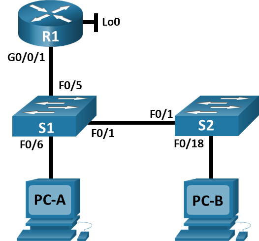


## Таблица адресации

---

## Цели

### Часть 1. Настройка основного сетевого устройства
•	Создайте сеть.
•	Настройте маршрутизатор R1.
•	Настройка и проверка основных параметров коммутатора
### Часть 2. Настройка сетей VLAN
•	Сконфигруриуйте VLAN 10.
•	Сконфигруриуйте SVI для VLAN 10.
•	Настройте VLAN 333 с именем Native на S1 и S2.
•	Настройте VLAN 999 с именем ParkingLot на S1 и S2.
### Часть 3: Настройки безопасности коммутатора.
•	Реализация магистральных соединений 802.1Q.
•	Настройка портов доступа
•	Безопасность неиспользуемых портов коммутатора
•	Документирование и реализация функций безопасности порта.
•	Реализовать безопасность DHCP snooping .
•	Реализация PortFast и BPDU Guard
•	Проверка сквозной связанности.

---

### Общие сведения и сценарий
Это комплексная лабораторная работа, нацеленная на повторение ранее изученных функций безопасности уровня 2.

Примечание: Маршрутизаторы, используемые в практических лабораторных работах CCNA, - это Cisco 4221 с Cisco IOS XE Release 16.9.3 (образ universalk9). В лабораторных работах используются коммутаторы Cisco Catalyst 2960 с Cisco IOS версии 15.0(2) (образ lanbasek9). Можно использовать другие маршрутизаторы, коммутаторы и версии Cisco IOS. В зависимости от модели устройства и версии Cisco IOS доступные команды и результаты их выполнения могут отличаться от тех, которые показаны в лабораторных работах. Правильные идентификаторы интерфейса см. в сводной таблице по интерфейсам маршрутизаторов в конце лабораторной работы.

Примечание: Убедитесь, что все настройки коммутатора удалены и загрузочная конфигурация отсутствует. Если вы не уверены, обратитесь к инструктору.

---

### Необходимые ресурсы
•	1 Маршрутизатор (Cisco 4221 с универсальным образом Cisco IOS XE версии 16.9.3 или аналогичным)
•	2 коммутатора (Cisco 2960 с операционной системой Cisco IOS 15.0(2) (образ lanbasek9) или аналогичная модель)
•	2 ПК (ОС Windows с программой эмуляции терминалов, такой как Tera Term)
•	Консольные кабели для настройки устройств Cisco IOS через консольные порты.
•	Кабели Ethernet, расположенные в соответствии с топологией
 
---

### Часть 1. Настройка основного сетевого устройства

#### Шаг 1. Создайте сеть.
a.	Создайте сеть согласно топологии.

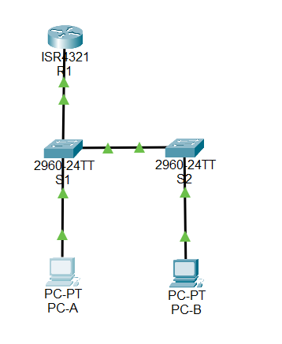

b.	Инициализация устройств

#### Шаг 2. Настройте маршрутизатор R1.
a.	Загрузите следующий конфигурационный скрипт на R1.
Откройте окно конфигурации
```
enable
configure terminal
hostname R1
no ip domain lookup
ip dhcp excluded-address 192.168.10.1 192.168.10.9
ip dhcp excluded-address 192.168.10.201 192.168.10.202
ip dhcp relay information trust-all
!
ip dhcp pool Students
 network 192.168.10.0 255.255.255.0
 default-router 192.168.10.1
 domain-name CCNA2.Lab-11.6.1
!
interface Loopback0
 ip address 10.10.1.1 255.255.255.0
!
interface GigabitEthernet0/0/1
 description Link to S1
 ip address 192.168.10.1 255.255.255.0
 no shutdown
!
line con 0
 logging synchronous
 exec-timeout 0 0
```
b.	Проверьте текущую конфигурацию на R1, используя следующую команду:
R1# show ip interface brief

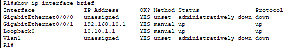

c.	Убедитесь, что IP-адресация и интерфейсы находятся в состоянии up / up (при необходимости устраните неполадки).
Закройте окно настройки.

#### Шаг 3. Настройка и проверка основных параметров коммутатора
a.	Настройте имя хоста для коммутаторов S1 и S2.

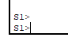

Откройте окно конфигурации
b.	Запретите нежелательный поиск в DNS.

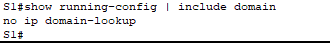

c.	Настройте описания интерфейса для портов, которые используются в S1 и S2.

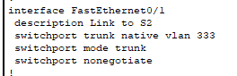

d.	Установите для шлюза по умолчанию для VLAN управления значение 192.168.10.1 на обоих коммутаторах.


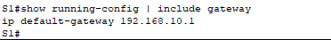

---

### Часть 2. Настройка сетей VLAN на коммутаторах.

#### Шаг 1. Сконфигруриуйте VLAN 10.
Добавьте VLAN 10 на S1 и S2 и назовите VLAN - Management.


#### Шаг 2. Сконфигруриуйте SVI для VLAN 10.

Настройте IP-адрес в соответствии с таблицей адресации для SVI для VLAN 10 на S1 и S2. Включите интерфейсы SVI и предоставьте описание для интерфейса.

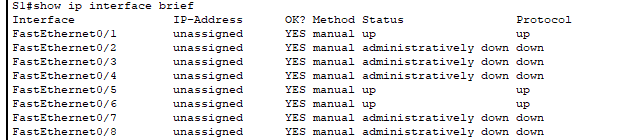


#### Шаг 3. Настройте VLAN 333 с именем Native на S1 и S2.

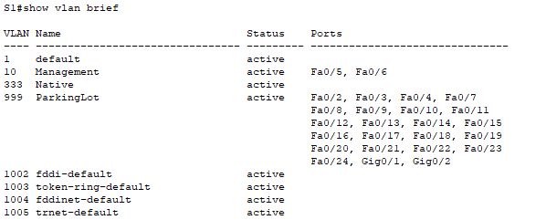


#### Шаг 4. Настройте VLAN 999 с именем ParkingLot на S1 и S2.


---

### Часть 3. Настройки безопасности коммутатора.

#### Шаг 1. Релизация магистральных соединений 802.1Q.
a.	Настройте все магистральные порты Fa0/1 на обоих коммутаторах для использования VLAN 333 в качестве native VLAN.
b.	Убедитесь, что режим транкинга успешно настроен на всех коммутаторах.
c.	Отключить согласование DTP F0/1 на S1 и S2. 
d.	Проверьте с помощью команды show interfaces.

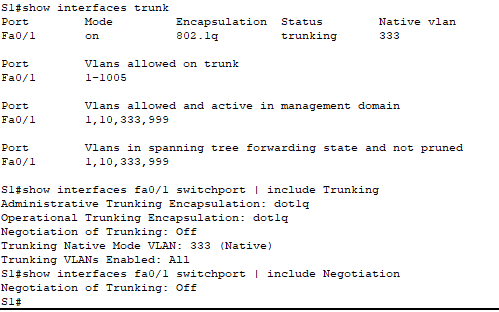

#### Шаг 2. Настройка портов доступа
a.	На S1 настройте F0/5 и F0/6 в качестве портов доступа и свяжите их с VLAN 10.
b.	На S2 настройте порт доступа Fa0/18 и свяжите его с VLAN 10.

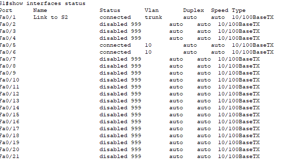

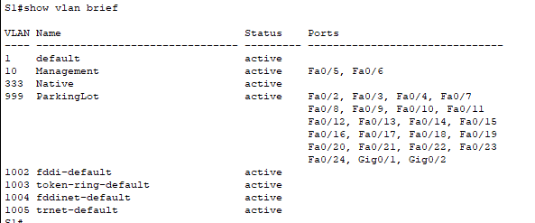

#### Шаг 3. Безопасность неиспользуемых портов коммутатора
a.	На S1 и S2 переместите неиспользуемые порты из VLAN 1 в VLAN 999 и отключите неиспользуемые порты.
b.	Убедитесь, что неиспользуемые порты отключены и связаны с VLAN 999, введя команду  show.

#### Шаг 4. Документирование и реализация функций безопасности порта.
Интерфейсы F0/6 на S1 и F0/18 на S2 настроены как порты доступа. На этом шаге вы также настроите безопасность портов на этих двух портах доступа.
a.	На S1, введите команду show port-security interface f0/6  для отображения настроек по умолчанию безопасности порта для интерфейса F0/6. Запишите свои ответы ниже.

Конфигурация безопасности порта по умолчанию
Функция	Настройка по умолчанию
Защита портов	
Максимальное количество записей MAC-адресов	
Режим проверки на нарушение безопасности	
d.	Включите безопасность порта для F0 / 18 на S2. Настройте каждый активный порт доступа таким образом, чтобы он автоматически добавлял адреса МАС, изученные на этом порту, в текущую конфигурацию.
e.	Настройте следующие параметры безопасности порта на S2 F / 18:
o	Максимальное количество записей MAC-адресов: 2
o	Тип безопасности: Protect
o	Aging time: 60 мин.
f.	Проверка функции безопасности портов на S2 F0/18.


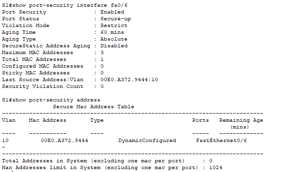 


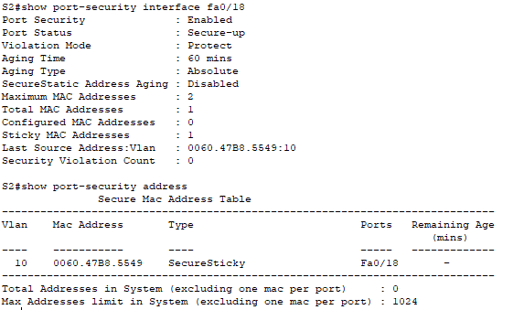


#### Шаг 5. Реализовать безопасность DHCP snooping.
a.	На S2 включите DHCP snooping и настройте DHCP snooping во VLAN 10.
b.	Настройте магистральные порты на S2 как доверенные порты.
c.	Ограничьте ненадежный порт Fa0/18 на S2 пятью DHCP-пакетами в секунду.
d.	Проверка DHCP Snooping на S2.

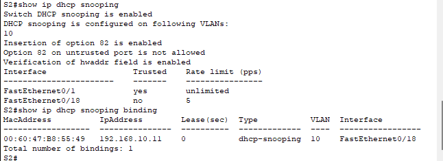

#### Шаг 6. Реализация PortFast и BPDU Guard
a.	Настройте PortFast на всех портах доступа, которые используются на обоих коммутаторах.
b.	Включите защиту BPDU на портах доступа VLAN 10 S1 и S2, подключенных к PC-A и PC-B.
c.	Убедитесь, что защита BPDU и PortFast включены на соответствующих портах.


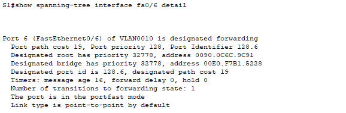  

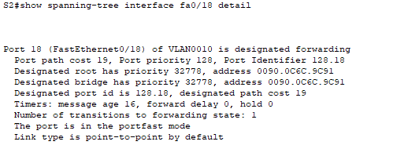

#### Шаг 7. Проверьте наличие сквозного подключения.
Проверьте PING свзяь между всеми устройствами в таблице IP-адресации. В случае сбоя проверки связи может потребоваться отключить брандмауэр на хостах.
Закройте окно настройки.

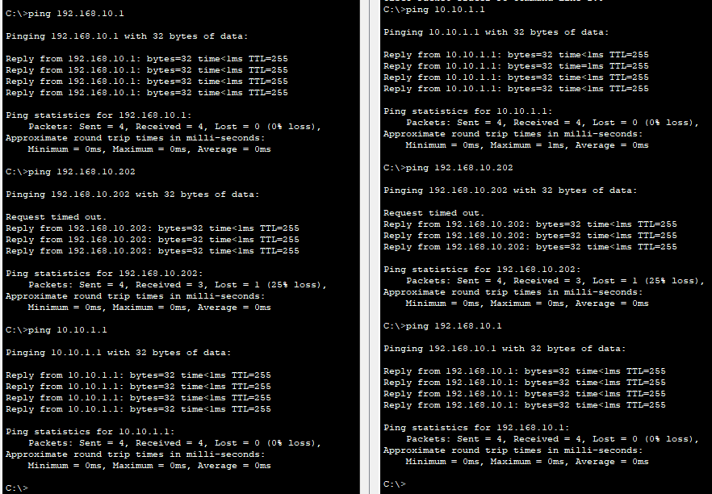
